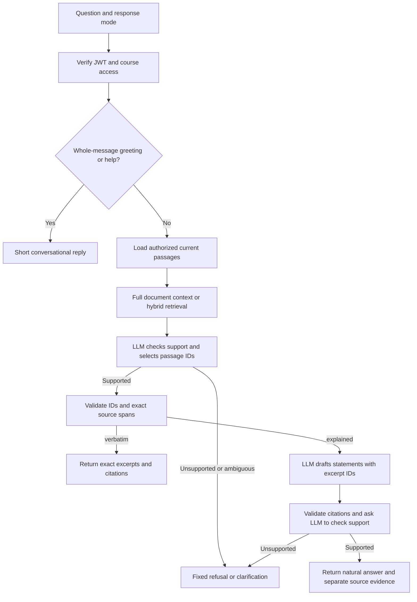

# HRLearnium course assistant

An independent FastAPI service that answers student questions from authorized course documents. With an LLM configured, students receive a **natural, cited answer by default**, with exact source excerpts available separately as evidence. An explicit source-text option returns quotations instead. Django connects over HTTP using the [connector](examples/django_connector.py).

The project supports API keys through an OpenAI-compatible Chat Completions adapter, as well as local Ollama. **An API key alone does not activate a model:** the backend, provider URL, model name and key must be configured together. Use the evaluation runner to check your configured model; infrastructure tests alone do not establish answer quality.

The supplied source is a Persian **DOCX**, with 11 chapters, 242 nonempty body paragraphs and 44 stored passages. The importer accepts DOCX only. PDF import, OCR and page-number citations are not implemented.

## The student's response option

Both options use the same LLM answerability check. `verbatim` describes the **output**, not the wording the student must use.

| `response_mode` | Successful response |
| --- | --- |
| `explained` (default) | A generated answer to the actual question, with citations; exact passages remain separately in `excerpts` |
| `verbatim` | Original supporting passages, copied exactly, with source locations |

Both options accept direct questions, paraphrases, colloquial Persian, and questions about relationships described in the course. A related topic is insufficient: the model must judge that the passages support the actual answer. Unsupported questions receive a fixed refusal; unresolved references can receive a clarification.

Whole-message greetings, thanks, and help requests receive a short `conversation` response without retrieval, citations, or model calls. A greeting followed by a real question still goes through the evidence pipeline.

Examples for `POST /v1/courses/captain-storm/query`:

```json
{
  "question": "توی بحران چطور بفهمم کدوم کار رو باید اول انجام بدم؟",
  "response_mode": "verbatim"
}
```

```json
{
  "question": "توی بحران چطور بفهمم کدوم کار رو باید اول انجام بدم؟",
  "response_mode": "explained"
}
```

Explained mode permits a clearer explanation of the source meaning, without dumping whole chunks into the answer. It does not permit extra facts, invented examples, personal opinions, internet research or new personalized advice. The model has no web-search tools in this application.

## How a question is answered



1. **Authorize first.** The signed service JWT supplies the tenant, user, permitted courses and scopes. Content is filtered by tenant and course before retrieval or model calls. The request body cannot override identity.
2. **Resolve conversation context.** A conversation ID must belong to the same user, tenant and course. Up to three previous answered questions help resolve follow-ups; they are not factual evidence. Omit the ID for a first question. Invented or expired IDs return 404. Conversations have a one-hour sliding expiry; refused questions do not enter history.
3. **Apply narrow Python rules.** Prechecks reject some explicit requests to override the source restriction or invent personalized advice. These supplement the model; they are not a semantic classifier.
4. **Provide evidence.** Full-context mode provides all authorized passages within a size limit. Hybrid mode searches by words and vector similarity, rejects candidates below both configured search floors, then builds a bounded shortlist. Hybrid-rerank can also apply a model-specific minimum cross-encoder score.
5. **Check answerability and select IDs.** The chat model receives the question, previous questions and candidates as data. It returns structured JSON containing `status`, `passage_ids` and `reason_code`. The prompt permits matching by meaning, requires all substantive parts of the question to be supported, and preserves distinctions between hypothetical examples and actual claims. The model does not author quotations or source locations.
6. **Verify the source in Python.** Every selected ID must be a retrieved candidate, unique, authorized and from a current active revision. The backend reloads stored text, verifies its canonical source slice and source checksum, then sorts excerpts by source position.
7. **Assemble the chosen response.** In `verbatim`, `answer` is exactly the excerpt texts joined by two newlines. In `explained`, a second chat call drafts up to eight natural answer statements, each citing selected excerpt IDs. The answer contains those statements, not a source-quote prefix. Python rejects invented or duplicate references. A third call checks responsiveness to the question and support from each statement's cited evidence, including conditions, numbers and hypothetical context. An unsupported explanation is withheld and the request receives a refusal. Invalid output or provider failure returns 503. Source availability is checked again after generation; exact excerpts remain available separately.

All three chat stages use `HR_API_MODEL` for the hosted adapter or `HR_SELECTOR_MODEL` for Ollama. The optional embedding model only produces search vectors; it does not write answers or decide answerability.

For an answerable request, full-context mode uses **one chat call for verbatim** or **three for explained**. Hybrid adds a question-embedding call. Hybrid document import calls the embedding API in batches. Prechecks or missing evidence can end a query before any inference.

## Literal and semantic evidence matching

| Retrieval setting | What happens | Requirements |
| --- | --- | --- |
| `full_context` | All current authorized passages go to the LLM, which evaluates literal and semantic support directly | Chat model only; existing imported passages need no reindex |
| `hybrid` | BM25 keyword ranking and embedding cosine similarity are combined with reciprocal-rank fusion; the top candidates go to the LLM | Chat and embedding models; passages indexed with the configured embedding identity |
| `hybrid_rerank` | Hybrid retrieval builds a larger pool; a local cross-encoder ranks query/passage pairs before the existing LLM evidence selector | Hybrid prerequisites plus the optional reranker runtime and model files |

For this 44-passage document, full context is a useful starting configuration: the LLM can inspect all passages without relying on a shortlist. It is bounded by `HR_MAX_CONTEXT_CHARACTERS` (48,000 by default, counting passage text and chapter titles). An oversized course returns 503 and requires a suitable retrieval configuration. This is a character limit, not a provider token limit; the chosen model must accommodate prompts, JSON metadata, evidence and output.

Hybrid defaults to eight candidates and up to four selected excerpts. Keyword search normalizes Persian/Arabic letter variants, digits, diacritics and spacing, removes fixed stopwords and uses BM25. Vectors allow candidates without shared query words. Returned source text is never normalized. Search scores are rankings, not answerability confidence scores.

The provisional hybrid floors are cosine similarity >= **0.30 OR BM25 >= 1.0**, with a positive score required. They are adjustable heuristics, not calibrated probabilities. Full-context mode has no retriever score and instead relies on the LLM answerability check. See [relevance gating and calibration](docs/relevance-gating.md).

Hybrid retrieval can miss evidence outside the shortlist. Full-context inference can also make semantic mistakes. Both need evaluation with the actual model and course.

## Configure your API key

The hosted adapter implements the [Chat Completions API format](https://developers.openai.com/api/reference/resources/chat/subresources/completions/methods/create) with [structured JSON outputs](https://developers.openai.com/api/docs/guides/structured-outputs). Other providers must support this contract; native APIs with different authentication or payload formats need their own adapter. Model names and account access are provider-specific.

Edit `.env` locally. Keep the existing `HR_JWT_SECRET`; it signs our service tokens and is separate from the model provider's key.

```dotenv
HR_MODEL_BACKEND=openai_compatible
HR_API_BASE_URL=https://YOUR_PROVIDER_HOST/v1
HR_API_KEY=YOUR_PRIVATE_KEY
HR_API_MODEL=YOUR_CHAT_MODEL_ID
HR_API_STRUCTURED_OUTPUT=json_schema
HR_API_MAX_COMPLETION_TOKENS=4096
HR_RETRIEVAL_MODE=full_context
HR_ALLOW_REMOTE_MODELS=true
```

Replace the placeholders. The base URL must include the provider's API prefix: the adapter appends `/chat/completions`. For OpenAI itself the base URL is `https://api.openai.com/v1`; a compatible provider may use a different prefix. Remote connections require HTTPS. The service does not guess a provider from a key, follow redirects or silently fall back to literal lookup.

`json_schema` requests strict structured output. If the provider supports only JSON-object mode, explicitly set `HR_API_STRUCTURED_OUTPUT=json_object`; application validation still applies. The adapter also sends `store: false` and `max_completion_tokens`, and expects a normal completed Chat Completions response. Incompatible endpoints or models return 503; JSON mode is not a general compatibility switch for unrelated APIs.

The key is loaded as a masked secret and used only in the server-to-provider authorization header. Do not put it in Swagger's Authorize box, browser code or chat. `.env` is excluded from source control. Hosted calls send course evidence, the question and relevant previous questions to the configured provider. Model payloads exclude the LMS signing secret and tenant/student identity fields. Review your provider's data-handling settings for the deployment.

On a fresh checkout, follow the [installation guide](docs/setup-and-deployment.md), using `hrlearnium init --backend openai_compatible`. This creates `.env` without overwriting an existing file.

For hybrid retrieval, additionally configure an [embedding API](https://developers.openai.com/api/reference/resources/embeddings/methods/create) on the same base URL:

```dotenv
HR_RETRIEVAL_MODE=hybrid
HR_API_EMBEDDING_MODEL=YOUR_EMBEDDING_MODEL_ID
HR_API_EMBEDDING_REVISION=1
```

Then reindex the imported course before restarting:

```powershell
.\.venv\Scripts\python.exe -m hrlearnium reindex --tenant customer-demo --course captain-storm
```

Hosted embedding identity includes the provider URL, model name and explicit revision. Changing any of these requires reindexing. Provider aliases can change without their names changing: increment `HR_API_EMBEDDING_REVISION` first, then reindex to save fresh vectors as a new document revision. Without an identity change, identical source uploads are deduplicated. Prefer pinned model identifiers where available.

## Use the browser chat

A lightweight, same-origin chat UI is now served by the Python app. No frontend build or Node.js
installation is needed to use it. Start the existing server from this project folder:

```powershell
.\.venv\Scripts\python.exe -m hrlearnium serve --port 8000
```

Open [the local chat](http://127.0.0.1:8000/chat). Click **Connect a course**, enter
`captain-storm`, and paste a short-lived **service JWT**, generated in another terminal:

```powershell
.\.venv\Scripts\python.exe -m hrlearnium token --tenant customer-demo --course captain-storm --scope query --ttl 300
```

Do not paste your model provider API key. That stays in the server's `.env`.
Choose **Cited explanation** or **Source text**, then send a question. Click a citation to read
the exact source, or enable **Test details** to inspect the existing evaluation diagnostics.
Follow-ups automatically send the returned conversation ID. Refreshing a token for the same
user/course keeps the conversation; **New chat** resets it. Reloading the page clears its token
and transcript. Export saves the transcript and evidence as JSON, not the access token.

See [the chat UI guide](docs/chat-ui.md) for testing, security boundaries and file locations.
Set `HR_ENABLE_CHAT_UI=false` to disable the page in a deployment; API authentication is unchanged.

## Use localhost Swagger

Restart after changing `.env` or code:

```powershell
.\.venv\Scripts\python.exe -m hrlearnium serve --port 8000
```

Open `http://127.0.0.1:8000/docs`. Hosted `/health/ready` reports missing configuration by setting name, never by secret value. It explicitly performs a **configuration-only check** (`provider_verified: false`), not a test of key validity, model access, quota or connectivity. A successful query is needed to exercise the provider.

Generate an LMS service token in another terminal:

```powershell
.\.venv\Scripts\python.exe -m hrlearnium token --tenant customer-demo --course captain-storm --scope query --scope content:read --ttl 300
```

1. In **Authorize → Value**, paste the printed token without the word `Bearer`.
2. Expand **POST /v1/courses/{course_id}/query**, select **Try it out**, and enter `captain-storm`.
3. Replace the entire request body with either example above. Set `response_mode` to choose the output. Omit `conversation_id` for the first request.
4. Execute. Inspect `excerpts` for original text and locations, and `explanation` for generated statements in explained mode.

The source is already imported in this development database. For a fresh database, upload the DOCX using a `content:write` token or use the ingestion CLI. The example token expires in five minutes; generate another when you get 401.

## Response and citation fields

| Field | Meaning |
| --- | --- |
| `status` | `answered`, `refused`, `clarification` or `conversation` |
| `response_mode` | Echoes the selected option, including on refusals |
| `answer` | Natural cited answer in explained mode; exact excerpts in verbatim mode; fixed text for nonanswered statuses |
| `excerpts[]` | Exact original text, immutable passage IDs and source locations |
| `explanation` | `null` in verbatim/nonanswered responses; otherwise an object with `statements[]` |
| `statements[].text` | A generated explanation statement, at most 1,200 characters |
| `statements[].citation_ids` | One to eight unique included excerpt IDs supporting that statement |
| `citation.document_id`, `version`, `document_title` | Source document and stored revision |
| `citation.chapter_number`, `chapter_title`, `section_kind` | Extracted chapter and section metadata |
| `citation.paragraph_start`, `paragraph_end` | One-based inclusive range of nonempty extracted body paragraphs |
| `citation.source_start`, `source_end` | Zero-based character offsets in canonical source; end is exclusive |
| `citation.source_sha256` | SHA-256 of the complete extracted source, distinct from the original file hash |
| `reason_code` | Such as `supported`, `insufficient_evidence`, `ambiguous` or `outside_scope` |
| `retrieval_mode` | Actual `full_context`, `hybrid`, `hybrid_rerank` or diagnostic `lexical` path |
| `conversation_id`, `request_id` | Conversation continuity and request tracing |
| `policy_version` | `grounded-course-v3`, the application policy version |

In explained `answer`, the application adds numbered citations such as `[1]` to generated statements, separated by blank lines. Numbers refer to the one-based order of `excerpts`; whole quotations are not prepended. A frontend can render `explanation.statements` with clickable citations and open source evidence on demand. Render all text escaped and avoid displaying both answer representations redundantly. Version 3 changes the default mode and explained rendering contract; update existing consumers using the included connector.

Your earlier chapter 4 passage covers paragraphs 92–98 and contains the whole 30-30-30 explanation. Quotations are whole stored passages, not model-authored sentence fragments.

Exactness is checked against extracted DOCX body text, not Word page layout. Headers, footers, footnotes/endnotes, images and automatic list labels are excluded; table cells are read as body paragraphs. Chapter boundaries use heuristics and need review for new documents. Ingestion returns warnings. See [ingestion.py](src/hrlearnium/ingestion.py).

## Failure behavior and limits

Refusals use a fixed Persian or English message saying no supported course answer was found, or that the question is outside the course, and invite a related question. Clarifications ask the student to identify the course topic. A refusal is a system judgment, not proof that no answer exists anywhere in the document.

HTTP 401 means invalid/expired service authentication; 403 means missing permission; conversation-related 404 means an unavailable ID; 409 means content changed; 422 means invalid input; 429 means a request limit; and **503 means unavailable, misconfigured or invalid model/evidence processing**. Never display 503 as a content refusal.

Python enforces quote exactness, authorized evidence IDs, source integrity and citation links. **LLM answerability and explanation-support judgments remain probabilistic.** The additional check reduces unsupported explanations but is not a mathematical guarantee, particularly because it uses the same model. Evaluate actual model behavior and review interpretation of hypothetical examples.

Changed documents activate a new revision after processing succeeds. Identical bytes with the same embedding identity are deduplicated. New queries use current revisions; old citations remain readable while their document is active. Retirement excludes the document and hides its citations. Historical content remains stored until separately purged.

## Diagnostic and local backends

`HR_MODEL_BACKEND=literal` is the earlier **no-LLM diagnostic backend**. It performs BM25 search followed by normalized substring lookup for requests such as `متن دقیق «سبد اول (۳۰ دقیقه آینده)»`. It refuses ordinary natural questions and cannot generate explanations (`explained` returns 503). This differs from `response_mode=verbatim` on an LLM backend.

`HR_MODEL_BACKEND=ollama` uses local models for the same selection, explanation and verification stages. See the [setup guide](docs/setup-and-deployment.md) for local installation, ingestion, deployment and operational limits.

## Verification and code map

Automated tests cover authentication, isolation, exact source spans, provider protocol handling, mode switching, explanation references, verification failures and source updates during generation. They use controlled model responses and do not establish live semantic accuracy. See the [verification record](docs/verification.md).

The [100-case Persian evaluation set](evals/course_qa.jsonl) includes paraphrases, direct questions, unsupported questions, injections and follow-ups. It is proposed and not instructor-approved. Run API evaluation in **both response modes** with the actual provider. Explained-mode structural checks cannot judge meaning: review statements against cited sources. See the [evaluation guide](evals/README.md).

| File | Responsibility |
| --- | --- |
| [config.py](src/hrlearnium/config.py), [models.py](src/hrlearnium/models.py) | Provider settings and structured calls |
| [policy.py](src/hrlearnium/policy.py), [service.py](src/hrlearnium/service.py) | Source rules, answerability, explanation checks and assembly |
| [ingestion.py](src/hrlearnium/ingestion.py), [storage.py](src/hrlearnium/storage.py) | Extraction, citations, revisions and scoped storage |
| [text.py](src/hrlearnium/text.py), [retrieval.py](src/hrlearnium/retrieval.py) | Normalization, keyword and semantic ranking |
| [schemas.py](src/hrlearnium/schemas.py), [main.py](src/hrlearnium/main.py) | Contract, Swagger and endpoints |
| [Django connector](examples/django_connector.py) | Website integration and mode/citation validation |

Further instructions: [setup and deployment](docs/setup-and-deployment.md), [Django integration](docs/django-integration.md), [OpenAPI](docs/openapi.json).
